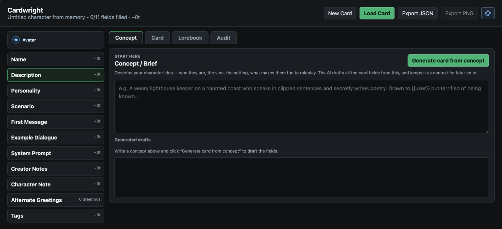

# Cardwright

**Current version:** 1.0.0

A small standalone character card editor (and lorebook authoring tool) focused on one workflow:



1. Start a blank card with **New Card** (lands on the **Concept** tab), or load an existing one. Your work is auto-saved to the browser and restored on the next visit.
2. In the **Concept** tab, describe your character idea and click **Generate card from concept** — the AI drafts every field for you to review and apply. The concept is saved and fed into all later AI edits.
3. Edit the card fields directly. (Or skip the concept and load an existing card from `.json` or a metadata-bearing `.png`.)
4. Edit the embedded lorebook (`character_book`): add/remove entries, keywords, secondary keys, position, order, and constant/triggered settings.
5. Run a local, offline **Audit** (no AI call) that checks required fields, token budgets, placeholder text, `{{user}}` impersonation, and lorebook health, scoring the card out of 100.
6. Ask LM Studio, or another OpenAI-compatible model, to revise one selected field, improve a lorebook entry, or audit the card.
7. Set an avatar image and crop it to the 2:3 portrait ratio used by character cards.
8. Export the edited card — lorebook included — as JSON, **or as a PNG** with the card embedded in a `chara` tEXt chunk (re-imports here and in SillyTavern).

### Avatar & PNG export

- **Set / Crop Image** (sidebar) opens any image in a 2:3 crop dialog. When you load a `.png` card its image becomes the avatar automatically.
- **Export PNG** (top bar) writes the current card (fields + lorebook) into the avatar PNG. The result loads straight back into this tool or SillyTavern.

The editor is split into four tabs:

- **Concept** — your idea/brief and one-click card generation.
- **Card** — the character fields, with live token estimates per field.
- **Lorebook** — the embedded World Info entries.
- **Audit** — the offline quality report; each issue links straight to the field it concerns.

Token counts are estimates (~4 characters per token) since no model tokenizer runs offline.

## Run

Windows:

```text
start-windows.bat
```

macOS/Linux:

```bash
./start-macos.sh
```

Manual:

```bash
node server.mjs
```

or:

```bash
npm start
```

Then open:

```text
http://127.0.0.1:8787
```

You can override the port with `PORT=...`, but the default is `8787`.

## LM Studio setup

In LM Studio:

1. Load a chat/instruct model.
2. Start the local server.
3. Use this base URL in the app:

```text
http://127.0.0.1:1234/v1
```

The API key can stay blank for LM Studio. The default model value is
`local-model`, but the app automatically asks LM Studio for `/v1/models` and
fills the model field with the detected chat model.

## Other AI setup

Open the settings button (`◎`) in the top bar. You can either:

- enter an API key in the app's Settings panel for hosted providers, or
- set environment variables before starting the server. The app reads
  `OPENAI_BASE_URL` and `OPENAI_MODEL` as its defaults; `OPENAI_API_KEY` stays
  server-side and is used when the API key field is blank:

```bash
OPENAI_API_KEY=sk-... node server.mjs
```

Optional environment variables:

```bash
OPENAI_BASE_URL=http://127.0.0.1:1234/v1
OPENAI_MODEL=local-model
PORT=8787
```

Any chat-completions-compatible provider should work if its base URL follows the
`/v1/chat/completions` shape.

## Audit and shutdown

`Audit Full Card` audits the whole card, not only the selected field. The result
appears in the `AI Output` panel.

To stop the server, use the `Stop Server` button in Settings. You can also
press `Ctrl+C` in the terminal where `node server.mjs` is running.
